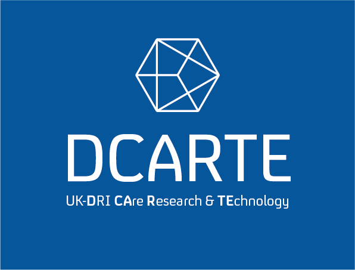

`DCARTE` UK-DRI CAre Research & TEchnology data ingestion tools. It is currently the simplest way to access the ongoing data collected by the UKDRI-CRT project and the legacy data collected by the TIHM project.

The tools were developed by Dr Eyal Soreq to standardize data-driven analysis across data domains (IoT, behavioral, physiological, etc.). The datasets are being collected as part of the ongoing UKDRI study, which aims to progress our understanding of the different manifestations of dementia. This package works either on the Imperial College London RDS cluster or on your computer running Python >3.9.

 
**Installation Options**
---
1. Install with [`pip`](https://pypi.org/project/stronghold/)
    + `$ pip install dcarte`

**Usage**
---
See example Jupyter notebooks 

**Inputs**
---

**UKDRI-CRT data sets**
---

3 zip files
 
Filename | Description | Duration
--- | --- | ---
tihm10.zip | Data collected by TIHM IoT system during TIHM project | (2016-2018)
tihm15.zip | Data collected by TIHM IoT system during TIHM 1.5 project (extension) | (2018-2019)
tihmdri.zip | Data collected by TIHM IoT system during DRI project | (2019-present) - exported once a week and copied to RDS

The TIHM system has undergone numerous iterations during this time. These exported datasets are extracted from historic backups taken at the end of each project. The original databases are MongoDB and do not have a consistent schema. The CSV exports harmonise these into a simplified, consistent tabular format. 

**How to Contribute**
---

1. Clone repo and create a new branch: `$ git checkout https://github.com/esoreq/TihmDRI_tools -b name_for_new_branch`.
2. Make changes and test
3. Submit Pull Request with comprehensive description of changes
