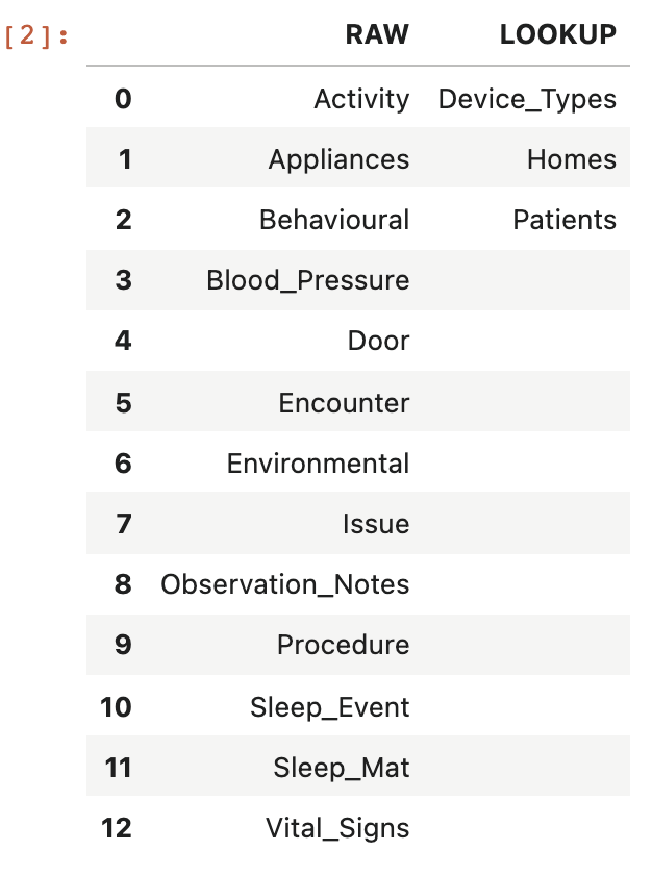
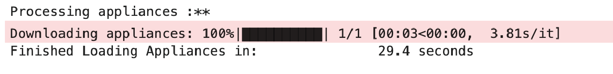
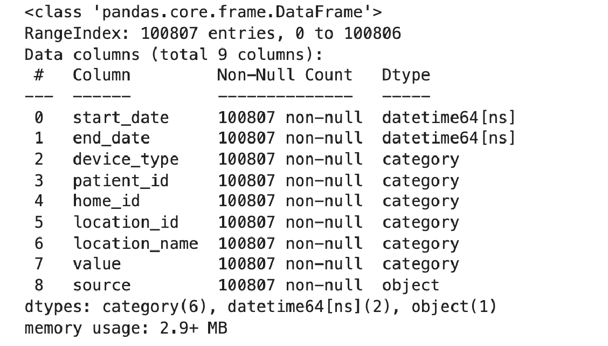
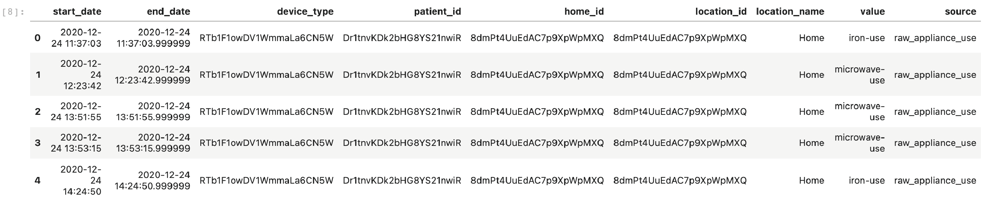

# Ingesting UKDRI CRT Data with the DCARTE

As stated before, the core functionality of dcarte lies in providing continuous access to the ongoing datasets collected by the UKDRI-CRT center.


## Downloading

The `domains()` command returns a data frame containing all of the datasets locally stored on your computer, allowing you to inspect the various datasets natively accessible in dcarte. Column headers represent domains, and any names in those columns represent datasets within that domain.

```python
dcarte.domains()
```




To load any dataset with dcarte, pass two arguments to the load function: the dataset name and the dataset domain.
Loading appliance activity information, for example, can be obtained using the following line of code:

```python
appliances = dcarte.load('appliances','raw')
```



Under the hood, dcarte will connect to the minder research site and request the raw appliances dataset predefined in dcarte. Once the request has been processed, the dataset will be downloaded to your local computer and will be ready to be utilised immediately after. In the code above, we define a variable called `appliances` and load a Pandas Dataframe containing the information stored in the minder research portal into it.

It is important to note, that the DataFrame object contains many functions that simplify the common data analytics needs. While it is beyond the scope of this tutorial to cover all the functionalities of Pandas, I will cover some of the central ones. For example the `info` method prints out information about a DataFrame. 
Try running the `appliances.info()` command and see if you get a similar output to the one plotted here.




Running the `head` or `tail` methods returns a printout of the first or last five rows of the DataFrame, respectively.

```python
appliances.head()
```




## Downloading a predifined slice of a dataset

The majority of the data offered by dcarte is time-related, often known as time-series tabular datasets. As a result, whenever you call dcarte, you are explicitly establishing a timeframe using the `since` and `until` arguments. The earliest time is by default 2019-04-01, and the latest time is the moment the command was issued, which is programmed as 'now()' throughout multiple datetime libereries. But these are adjustable for example running the command below will download a slice of the PIR activity data from 2021-04-01 and until 2021-08-01. 

```python
vital_signs = dcarte.load('Vital_Signs','raw',since='2021-04-01',until='2021-08-01',reload=True)
```

As you can see, although having nearly the same number of observations, this dataset takes longer to download. This is because dcarte is combining data from 10 distinct sources beneath the hood, each of which represents a different metric. Using the information we presented before, try to compute the precise number of observations.

Using the `agg` method we can test the dataset duration and examine the number of observations in one line.  

```python
vital_signs.start_date.agg(['min','max', 'count'])
```

## Loading a local dataset 

One of the primary motivations for developing dcarte was to reduce the pre-processing time required to investigate a dataset. Consequently, dcarte saves a local snapshot of any previously used dataset and loads that snapshot instead of reloading the web dataset. This can be easily demonstrated by reloading the same dataset we just downloaded using the followig line of code:

```python
vital_signs = dcarte.load('vital_signs','raw')
```

As you can see, this dataset loads several hundred times faster than it did during the initial download.

## Updating a dataset to the present time

The flexibility to update raw and derived datasets to reflect the ongoing nature of our cohort is one of the most valuable features of dcarte. This is acheived using the `update` argument. Using the same example we will now update the activity dataset to the most recent snapshot.

```python
vital_signs_updated = dcarte.load('vital_signs','raw',update=True)
```

Rerun the previously introduced `agg` function and compare the outputs before and after the update request.


## Reloading a dataset 

Importantly, when you update a dataset, the arguments you gave when you originally downloaded or updated it will be reflected.
When the source dataset changes, the dataset must be downloaded again; this is easily performed by using the `reload` argument.


```python
vital_signs_updated = dcarte.load('vital_signs','raw',reload=True, until='2021-09-01')
```

Rerun the `agg` function to observe the differences between the different arguments.
